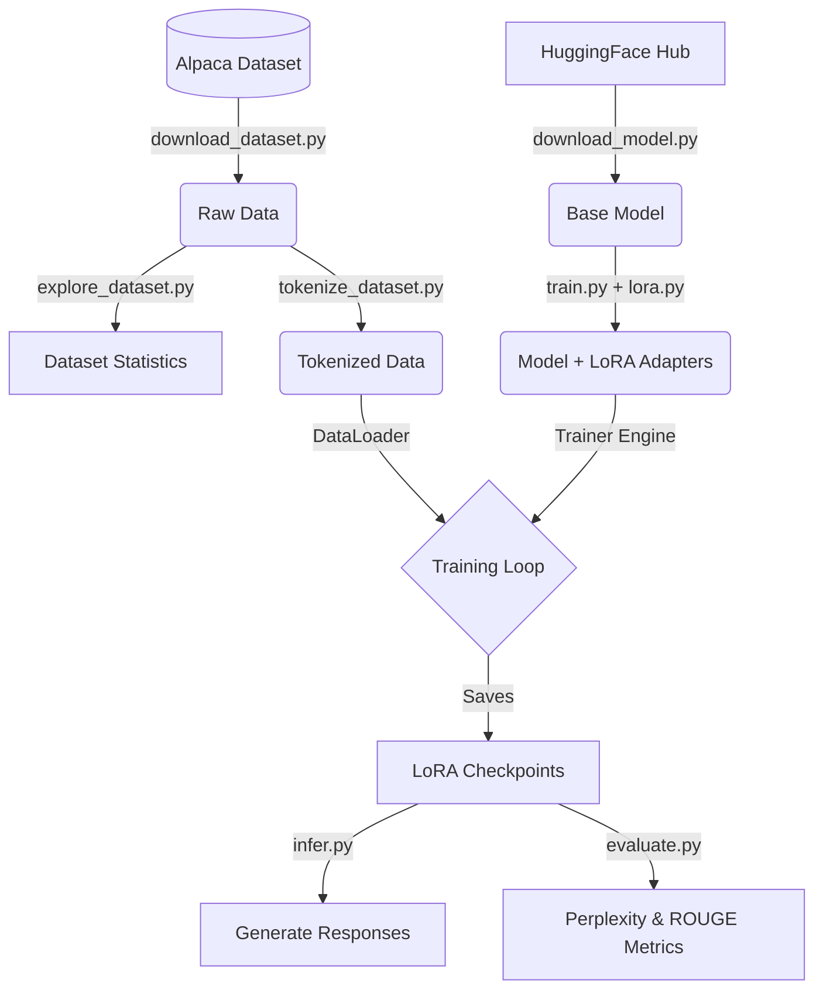

# Finetuning LLMs with LoRA: An Educational Implementation


This repository serves as a complete, end-to-end educational project demonstrating how to fine-tune Large Language Models (LLMs) on consumer hardware using Low-Rank Adaptation (LoRA). The project is built from scratch with PyTorch and HuggingFace's ecosystem, designed specifically to understand the full lifecycle of LLM training rather than just using high-level wrappers.

By default, the project fine-tunes **[Qwen/Qwen2.5-0.5B-Instruct](https://huggingface.co/Qwen/Qwen2.5-0.5B-Instruct)** on the **Alpaca Cleaned** dataset, making it lightweight enough to train on GPUs with as little as 6GB of VRAM (like an RTX 3050).

## 🚀 Features & What I've Built

This project breaks down the LLM fine-tuning pipeline into modular, understandable components:

- **End-to-End Pipeline**: From raw dataset downloading to inference, every step is explicitly scripted.
- **LoRA Integration**: Uses HuggingFace PEFT to inject trainable low-rank matrices into the model's attention layers (`q_proj`, `k_proj`, `v_proj`, `o_proj`), reducing trainable parameters to just ~0.2% of the full model.
- **Custom Training Loop**: Features a fully custom PyTorch training engine (`engine.py` and `trainer.py`) rather than relying on the HF `Trainer`, exposing exactly how gradient accumulation, loss calculation, and optimization work.
- **Robust Evaluation**: Includes perplexity calculation over the validation set and ROUGE score metrics for generated text comparison.
- **Hardware Aware**: Automatically detects CUDA, moves models/tensors efficiently, and supports mixed-precision capabilities natively.
- **Configuration Driven**: Clean separation of configs for models, datasets, and training hyperparameters using YAML files.

---

## 🏗️ Architecture & Pipeline



---

## ⚙️ Project Structure

```text
finetuning-llm/
├── configs/                # YAML configuration files
│   ├── dataset.yaml        # Train/val split and seed config
│   ├── model.yaml          # Base model and tokenizer config
│   └── train.yaml          # Hyperparameters and LoRA config
├── data/                   # Data directory (ignored in git)
│   ├── cache/              # HF dataset cache
│   ├── processed/          # Formatted prompt data
│   └── tokenized/          # Final tokenized tensors
├── models/                 # Downloaded base models
├── outputs/                # Training outputs
│   ├── checkpoints/        # Saved LoRA adapter weights
│   └── metrics/            # Evaluation reports
├── scripts/                # Entrypoint scripts for the pipeline
├── src/                    # Core modules
│   ├── data/               # Loading, formatting, tokenizing
│   ├── inference/          # Generation utilities
│   ├── model/              # Downloading and LoRA wrapping
│   └── training/           # Engine, dataloader, metrics
└── pyproject.toml          # uv Dependency management
```

---

## 🛠️ Setup & Installation

This project uses [uv](https://github.com/astral-sh/uv) for lightning-fast dependency management and explicitly locks PyTorch to the CUDA 12.8 wheel for out-of-the-box GPU acceleration.

1. **Install `uv`** (if not already installed):
   ```bash
   pip install uv
   ```

2. **Sync the environment**:
   ```bash
   uv sync
   ```
   *Note: This will download PyTorch with CUDA support automatically (~2.6GB).*

---

## 🏃‍♂️ Running the Pipeline

Run the scripts in this exact order to execute the full pipeline.

### 1. Prepare Data and Model
```bash
# Download the Alpaca dataset
uv run python -m scripts.download_dataset

# Tokenize the dataset and split into train/val
uv run python -m scripts.tokenize_dataset

# Download the base Qwen 0.5B model
uv run python -m scripts.download_model
```

### 2. Verify Backward Pass
Ensure your GPU and tensors are working correctly before starting a long training run:
```bash
uv run python -m scripts.backward_pass
```

### 3. Fine-Tune the Model
Start the custom training loop. Settings like batch size and epochs can be modified in `configs/train.yaml`.
```bash
uv run python -m scripts.train
```

### 4. Evaluate & Infer
Evaluate the model's perplexity and ROUGE scores on the validation set:
```bash
uv run python -m scripts.evaluate
```

Test the model interactively (you can edit the prompts inside the script):
```bash
uv run python -m scripts.infer
```

---

## 📊 Configuration Reference

All configurations are handled via YAML files in `configs/`.

| File | Purpose | Key Variables |
|---|---|---|
| `dataset.yaml` | Controls data splitting | `train_split`, `validation_split`, `random_seed` |
| `model.yaml` | Controls base model | `name`, `local_path`, `max_length`, `cache_dir` |
| `train.yaml` | Controls hyperparameters | `batch_size`, `device`, `r`, `alpha`, `learning_rate` |

---

## 💡 Key Learnings & Takeaways

Through building this project, I gained hands-on experience with:
1. **Memory Management**: Understanding how gradients, optimizer states, and LoRA rank (`r`) impact VRAM usage on a 6GB GPU.
2. **Tokenization Nuances**: Managing padding tokens, max lengths, and ensuring labels are correctly aligned with inputs for Causal Language Modeling.
3. **Custom Training Engines**: Moving away from the 'black-box' `Trainer` classes to manually handle `loss.backward()`, optimizer steps, and gradient accumulation.
4. **Evaluation**: Properly generating text for ROUGE scoring vs calculating loss for perplexity.
